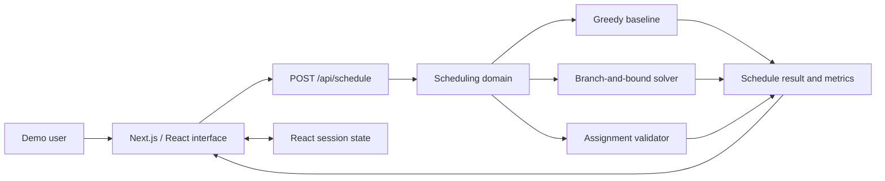
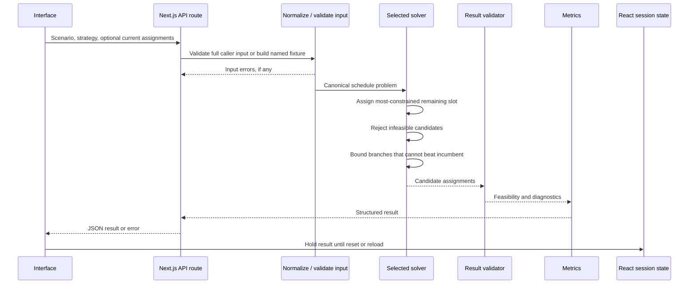

# ShiftCraft architecture

Last updated: 2026-09-04

## System context

ShiftCraft is a scheduling demonstration for the fictional Harbour & Pine Café. A manager-shaped user selects a synthetic weekly scenario, runs a solver, reviews feasibility and quality metrics, optionally changes an assignment, and can simulate an absence. A first-party Next.js route validates the request and calls the in-repository domain engine; no external optimizer or data service participates in the scheduling decision.

This is a modular Next.js application, not a distributed system. Next.js supplies the application shell, first-party route, and build pipeline. The scheduling engine is dependency-light TypeScript callable independently of React and the route. Demo state exists only in the current page session.

## Architectural boundaries

| Boundary | Responsibility | Must not own |
| --- | --- | --- |
| Presentation | Scenario controls, schedule grid, diagnostics, metric comparison, absence and manual-edit interactions | Feasibility rules or solver search logic |
| Application orchestration | Turn UI intent into domain operations; select scenario; run, compare, validate, and recover | Rendering details or API transport internals |
| API contract and route | Validate either a complete caller-supplied model or a named fixture request, call domain operations, and return structured success/error JSON | Persistent state or duplicated feasibility rules |
| Scheduling domain | Entities, time calculations, hard-rule validation, preference/disruption scoring, result metrics | Browser APIs or React state |
| Solvers | Produce candidate assignments using a common problem/result contract | UI messages or session-state management |
| Session state | Hold the selected scenario, results, comparisons, and manual edits until reset/reload | Durable storage or scheduling decisions |
| Synthetic fixtures | Define the café roster and the three reproducible scenarios | Claims about real businesses or users |

Dependencies point inward: the interface and API route may depend on domain/API contracts, while domain and solver modules must not import React, Next.js, or browser globals. Both solvers consume the same normalized problem and return the same result shape so the comparison is meaningful.

## Domain model

The core concepts are:

- **Staff member:** stable identifier, display name, skills, availability windows, maximum weekly hours, and weighted preferences.
- **Shift / slot:** stable identifier, day, start, end, and required skill. A shift can contain one or more coverage slots if the scenario needs multiple people.
- **Assignment:** a staff member allocated to a slot.
- **Schedule problem:** staff, slots, existing assignments when rescheduling, hard constraints, and scoring weights.
- **Schedule result:** assignments, unfilled slots or infeasibility diagnostics, metrics, and solver metadata.

Time should be normalized before solving. Comparisons and duration calculations must use one canonical representation rather than locale-formatted strings. Identifiers, rather than array positions or display names, link entities.

## Constraints and preferences

The distinction is semantic, not cosmetic.

### Hard constraints

A candidate schedule is feasible only if all of these hold:

- the assigned staff member is available for the entire slot;
- the staff member has the slot's required skill;
- every required slot has exactly one assignment;
- assigned weekly hours do not exceed that staff member's maximum;
- a staff member is not assigned to overlapping shifts.

Hard constraints are validation gates and search-pruning rules. A weighted score must never compensate for a hard violation. When full coverage is impossible, the result must say so and identify unfilled demand; it must not present an invalid roster as feasible.

### Soft preferences

Preferences rank otherwise valid schedules. Examples include a staff member preferring or avoiding a particular time and, during recovery, retaining an existing valid assignment. Weights express relative importance within the demonstration. They are configurable product assumptions, not measured employee utility.

Rescheduling adds a disruption cost for assignments that change. An absence makes the absent employee's affected assignments invalid; all other existing valid assignments should be favored so recovery is stable by default. The UI reports both preference satisfaction and assignments changed so the trade-off remains visible.

## Scheduling pipeline

The greedy solver is a baseline: it makes the best available local choice without revisiting earlier choices. The branch-and-bound solver searches alternatives deterministically, backtracks after dead ends, and prunes a branch only when its optimistic score cannot improve on the best known feasible result. Stable slot ordering, stable staff ordering, and explicit tie-breakers make identical input produce identical assignments.

Worst-case search remains exponential. Small synthetic weeks, early hard-rule pruning, most-constrained-first ordering, deterministic candidate ordering, and an optimistic score bound keep the documented demonstration responsive. The public route uses exhaustive search for the bundled fixture. If `maxNodes` stops a caller-invoked solve, the result is `search_limit` with `termination: max_nodes` and `optimality: unknown`; it never claims feasibility, infeasibility, or optimality without proof.

Manual edits pass through the independent domain validator. Absence recovery removes the absent staff from the input, gives every previous non-absent assignment a dominant retention bonus, and then solves the complete coverage problem. This makes disruption the primary recovery objective and ordinary shift preferences the tie-breaker.

## Session state

Runtime state belongs in React/application state. The current implementation intentionally has no persistence adapter:

- results and manual edits remain in memory for the current page session;
- **Reset demo** returns to the default scenario and clears results;
- reload or tab close discards state;
- no state is written to browser storage or a server-side store.

There is no account, encryption layer, access control, audit log, synchronization, or backup. The interface labels edits as session-only and discourages real employee data. Any future persistence—browser-local or server-side—requires a separate schema, validation, privacy, and migration decision.

## Error handling and observability

Expected domain outcomes are structured results rather than thrown exceptions: invalid request, infeasible coverage, and rejected manual assignments. Unexpected defects may reach the route's internal-error response, framework error boundary, or developer console. Solve duration and search counters are diagnostic measurements for the current runtime and scenario; they are not service-level benchmarks.

The project has no production telemetry pipeline. Adding analytics or persistence later requires a separate privacy decision because current state is intentionally ephemeral.

## Testing architecture

- **Unit tests:** time calculations, overlap checks, skill/availability/hour validation, objective scoring, deterministic tie-breaking, and branch pruning.
- **Scenario tests:** feasible rush week, known keyholder gap, and barista absence recovery with expected invariants.
- **Differential tests:** both solvers receive identical input; every claimed feasible result passes the independent validator.
- **UI/component tests:** controls, disclosures, diagnostics, and metric rendering.
- **End-to-end tests:** run the primary scheduling flow in a browser, exercise recovery, reset it, and confirm reload discards session state.

CI runs installation, linting, type checking, unit/integration tests, a production build, Playwright against the production server, and secret scanning. The same Playwright suite is also run against the exact Vercel alias before release is called verified.

## Deployment topology

The deployable artifact is a single Next.js application with one scheduling route. It requires no database, queue, external optimizer, secret, or background worker for the documented demo. It must run on a host that supports the Next.js route; schedule results are returned without server-side persistence and remain only in current React session state.

## Extension rules

- Add a hard rule to the independent validator first, then use the same predicate to prune every solver.
- Add a soft preference as a named score component and expose its weight; do not hide it in UI code.
- Keep new solvers behind the common problem/result contract and validate their output independently.
- Treat any future persistence as a new boundary with runtime validation, versioning, migration, and privacy tests.
- Treat multi-user state, real employee data, compliance logic, integrations, or server-side persistence as new architecture decisions rather than incremental UI features.
- Record material choices in `docs/adr/` and update this document when dependency direction or trust boundaries change.

## Known architectural limits

The design is intentionally optimized for a small, synthetic weekly café schedule. It does not establish solver performance at larger scales, legal compliance, fairness, accessibility with target users, or operational fitness. See [Scope and limitations](scope-and-limitations.md) and the [solver ADR](adr/adr-0001-dependency-light-branch-and-bound.md).
